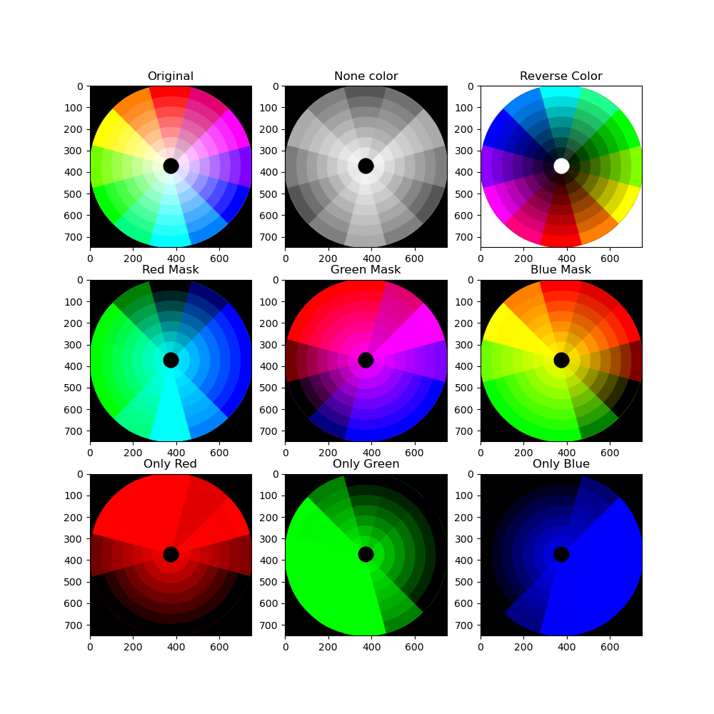
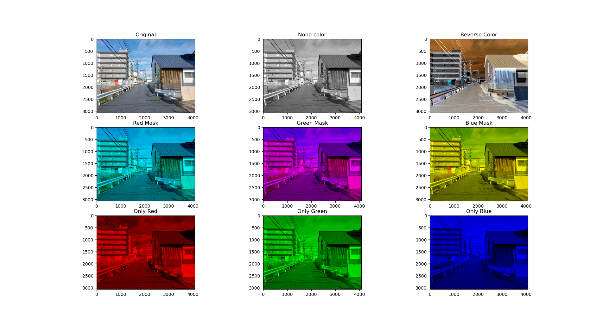

# **Converting color by CV2 and render it by matplotlib**
## **Made by 202434746 Tae Yoon Kim**
---
### **Very simple Color filter**
##### you can see your picture with none color, reverse, mask color, only color at once.
##### It has simple structures, and shows the result directly.
##### So, anyone can use it very easily.

### **Key Points**
---
##### 1. Copy the image to make converted images.
##### 2. Such a copy will convert by its filter.
##### None color: Set all color to average of red, green, and blue
##### Reverse color: Set color's value to 'MAX - its value'
##### Mask color: The target color's value will set '0'
##### Only color: All color's value wull set '0' except the target color
##### 3. Showing converted images with 3*3 tables by using matplotlib
##### (Prevent becoming wierd colors by declaring 'COLOR_BGR2RGB')
##### 4. With matplotlib plots, compare converted images with the original at once

### **Requirements:(The version could be updated)**
---
##### 1. python (3.12.7)
##### 2. opencv (4.10.0)
##### 3. numpy (2.13.0)
##### 4. matplotlib (3.9.2)

### **How to execute the program:**
---
```sh
python color_converter.py --image ./color.png
```

### **Result**
---


##### all converted images are rendered by 3*3 tables.

---
### **The limitations**
---
##### It doesn't have the potential to utilize in various purposes. Therefore, it can be used in the limited way.
