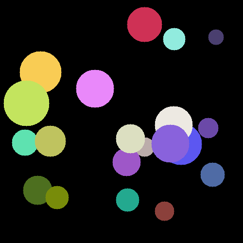

# FIGURE_GENERATE
#### 202434753 김현수
___
## Explain
To detect triangles, squares, and circles in images To create new images with the most detected shapes.

## Used Package
- OpenCV
- NumPy

## How to Execute
```sh
pip install opencv-python numpy
python main.py
```

## Results
### Input


### Output


## 참고 자료
- [OpenCV Documentation](https://docs.opencv.org/)
